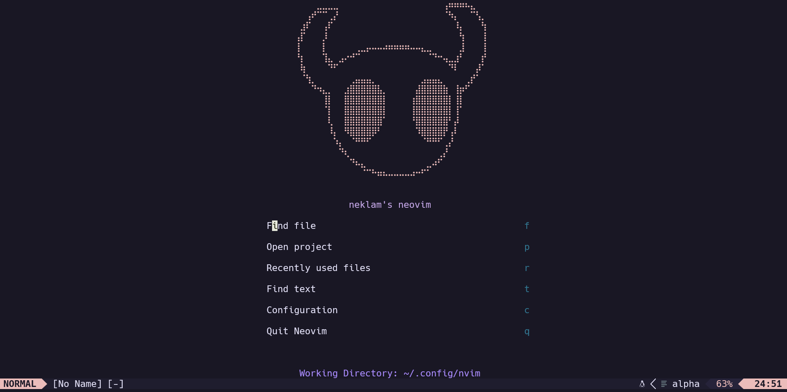
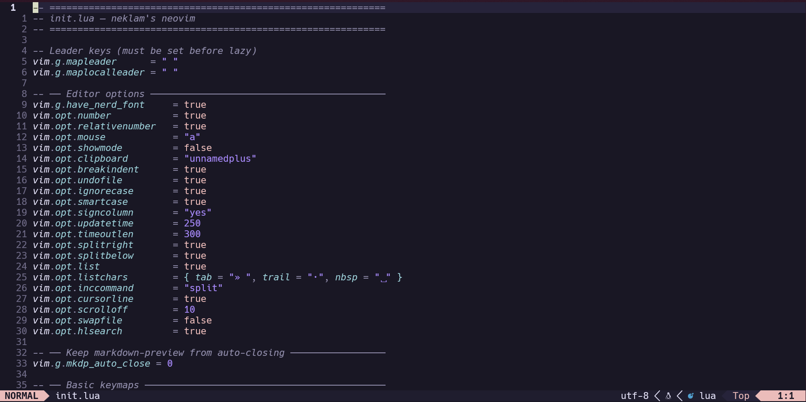

# neklam's neovim

A lean, modular Neovim configuration built for a **Python / AI / DevOps** workflow.
Managed with [lazy.nvim](https://github.com/folke/lazy.nvim). Plugins load only when needed.

---

## Screenshots

### Dashboard



The start screen is powered by [alpha-nvim](https://github.com/goolord/alpha-nvim) with a custom ASCII art header of the **Knight** from [Hollow Knight](https://www.hollowknight.com/) by Team Cherry — hand-crafted in braille Unicode characters.

### Editor



---

## Stack this config is optimised for

| Domain | Technologies |
|---|---|
| **Backend** | Python (async, OOP), FastAPI, Pydantic, PostgreSQL, Redis |
| **AI / LLM** | Claude & OpenAI APIs, RAG pipelines, LangChain, LlamaIndex, MCP, pgvector |
| **DevOps** | Docker, Docker Compose, GitHub Actions, AWS (EC2, S3, Lambda, ECS) |
| **MLOps** | MLflow, W&B, RAGAS, LangSmith |

---

## Requirements

| Dependency | Minimum version | Notes |
|---|---|---|
| [Neovim](https://github.com/neovim/neovim/releases) | **0.10+** | Required for `vim.lsp.config` API |
| [git](https://git-scm.com/) | 2.31+ | Required by lazy.nvim and diffview |
| [Node.js](https://nodejs.org/) | 18+ | Required by Mason for yamlls, jsonls, dockerls |
| [Python](https://www.python.org/) | 3.10+ | Required by pyright, ruff, debugpy |
| A [Nerd Font](https://www.nerdfonts.com/font-downloads) | any | For icons (set as your terminal font) |

---

## Installation

### 1. Clone the repo

```bash
# Back up any existing config first
mv ~/.config/nvim ~/.config/nvim.bak 2>/dev/null

git clone https://github.com/<your-username>/nvim ~/.config/nvim
```

### 2. Install external dependencies

```bash
cd ~/.config/nvim
chmod +x nvim-deps-install.sh
./nvim-deps-install.sh
```

This script installs:
- **ruff** — Python linter + formatter (replaces black / isort / flake8)
- **prettier** — YAML, JSON, Markdown formatter
- **debugpy** — Python debug adapter (into a dedicated `~/.virtualenvs/debugpy` venv)
- Checks for Node.js, Python 3, git, and optional tools (taplo, shfmt)

### 3. Open Neovim

```bash
nvim
```

On first launch, lazy.nvim bootstraps itself and downloads all plugins.
Mason then auto-installs all LSP servers, formatters, and linters in the background.
You can watch Mason's progress with `:Mason`.

### 4. Verify

```vim
:checkhealth
:MasonToolsInstall   " triggers manual install if auto-install didn't fire
```

---

## Plugin overview

### Core / UI

| Plugin | Purpose |
|---|---|
| [goolord/alpha-nvim](https://github.com/goolord/alpha-nvim) | Start screen dashboard |
| [rose-pine/neovim](https://github.com/rose-pine/neovim) | Colorscheme |
| [nvim-lualine/lualine.nvim](https://github.com/nvim-lualine/lualine.nvim) | Status line |
| [nvim-tree/nvim-tree.lua](https://github.com/nvim-tree/nvim-tree.lua) | File explorer |
| [folke/which-key.nvim](https://github.com/folke/which-key.nvim) | Keymap popup on leader pause |

### Navigation & Search

| Plugin | Purpose |
|---|---|
| [nvim-telescope/telescope.nvim](https://github.com/nvim-telescope/telescope.nvim) | Fuzzy finder |
| [nvim-telescope/telescope-project.nvim](https://github.com/nvim-telescope/telescope-project.nvim) | Project switcher |
| [ThePrimeagen/harpoon](https://github.com/ThePrimeagen/harpoon) | Per-project buffer bookmarks |

### LSP & Completion

| Plugin | Purpose |
|---|---|
| [neovim/nvim-lspconfig](https://github.com/neovim/nvim-lspconfig) | LSP client configs |
| [williamboman/mason.nvim](https://github.com/williamboman/mason.nvim) | LSP / DAP / formatter installer |
| [hrsh7th/nvim-cmp](https://github.com/hrsh7th/nvim-cmp) | Completion engine |
| [L3MON4D3/LuaSnip](https://github.com/L3MON4D3/LuaSnip) | Snippet engine |
| [b0o/schemastore.nvim](https://github.com/b0o/schemastore.nvim) | JSON / YAML schema catalog for docker-compose, GH Actions, etc. |

**LSP servers managed by Mason:**

`pyright` · `ruff` · `lua_ls` · `clangd` · `yamlls` · `jsonls` · `dockerls` · `docker_compose_language_service`

### Formatting & Linting

| Plugin | Purpose |
|---|---|
| [stevearc/conform.nvim](https://github.com/stevearc/conform.nvim) | Async formatter (format on save) |

**Formatters by filetype:** `python` → ruff · `lua` → stylua · `yaml/json/md` → prettier · `toml` → taplo · `sh` → shfmt

### Git

| Plugin | Purpose |
|---|---|
| [lewis6991/gitsigns.nvim](https://github.com/lewis6991/gitsigns.nvim) | Gutter signs, hunk staging, inline blame |
| [sindrets/diffview.nvim](https://github.com/sindrets/diffview.nvim) | Side-by-side diff & file history |

### Debugging (Python)

| Plugin | Purpose |
|---|---|
| [mfussenegger/nvim-dap](https://github.com/mfussenegger/nvim-dap) | Debug Adapter Protocol client |
| [mfussenegger/nvim-dap-python](https://github.com/mfussenegger/nvim-dap-python) | Python adapter (debugpy) |
| [rcarriga/nvim-dap-ui](https://github.com/rcarriga/nvim-dap-ui) | DAP UI panels |

### Python workflow

| Plugin | Purpose |
|---|---|
| [linux-cultist/venv-selector.nvim](https://github.com/linux-cultist/venv-selector.nvim) | Fuzzy-pick and activate Python venvs, notifies pyright automatically |

### Editing quality-of-life

| Plugin | Purpose |
|---|---|
| [windwp/nvim-autopairs](https://github.com/windwp/nvim-autopairs) | Auto-close brackets / quotes |
| [numToStr/Comment.nvim](https://github.com/numToStr/Comment.nvim) | Smart commenting with Treesitter context |
| [folke/trouble.nvim](https://github.com/folke/trouble.nvim) | Diagnostics / references panel |
| [nvim-treesitter/nvim-treesitter](https://github.com/nvim-treesitter/nvim-treesitter) | Syntax highlighting & text objects |

### Markdown

| Plugin | Purpose |
|---|---|
| [iamcco/markdown-preview.nvim](https://github.com/iamcco/markdown-preview.nvim) | Live browser preview |

---

## Key mappings

See [KEYMAPS.md](./KEYMAPS.md) for the full reference.

**Leader key:** `Space`

Quick reference of the most-used mappings:

| Key | Action |
|---|---|
| `<leader>f` | Find files |
| `<leader>w` | Live grep |
| `<leader>p` | Switch project |
| `<Tab>` | Toggle file tree |
| `<C-e>` | Harpoon menu |
| `<leader>cv` | Select Python venv |
| `<leader>cf` | Format file |
| `<leader>dc` | Start / continue debugger |
| `<leader>db` | Toggle breakpoint |
| `<leader>gd` | Open diffview |
| `<leader>gb` | Toggle git blame |

---

## Structure

```
~/.config/nvim/
├── init.lua                    ← entry point, options, core keymaps
├── lua/
│   └── plugins/
│       ├── init.lua            ← plugin manifest (lazy.nvim)
│       ├── alpha.lua
│       ├── comment.lua
│       ├── conform.lua         ← formatting
│       ├── dap.lua             ← debugger
│       ├── diffview.lua        ← git diff viewer
│       ├── gitsigns.lua        ← git gutter & blame
│       ├── harpoon.lua
│       ├── lsp.lua             ← all LSP servers
│       ├── lualine.lua
│       ├── markdownpreview.lua
│       ├── nvim-autopairs.lua
│       ├── nvim-cmp.lua        ← completion
│       ├── nvim-tree.lua
│       ├── project.lua
│       ├── rose-pine.lua
│       ├── telescope.lua
│       ├── treesitter.lua
│       ├── trouble.lua
│       ├── venv-selector.lua   ← Python venv switcher
│       └── which-key.lua
├── nvim-deps-install.sh        ← external dependency installer
├── KEYMAPS.md
└── README.md
```

---

## Switching Python environments

```
<leader>cv     → opens venv picker (Telescope)
```

`venv-selector.nvim` searches common venv locations (`./venv`, `./.venv`, `~/virtualenvs/`, pyenv, conda). Selecting one automatically notifies pyright and ruff of the new interpreter path — no restart required.

---

## Debugging Python

1. Make sure debugpy is installed: `~/.virtualenvs/debugpy/bin/python -m debugpy --version`
2. Set a breakpoint: `<leader>db`
3. Start: `<leader>dc`
4. The DAP UI opens automatically

For FastAPI: create a launch configuration that runs `uvicorn` with `--reload` disabled, or attach to a running process using `require("dap").attach()`.

---

## Credits

Configuration by **neklam**. Built on the shoulders of the Neovim plugin ecosystem.

Special thanks to [ThePrimeagen](https://www.youtube.com/@ThePrimeagen) — his Neovim videos and live coding streams were a major source of inspiration for this config. If you're new to Neovim or want to go deeper, his channel is the best place to start. Also the reason Harpoon is in here.
